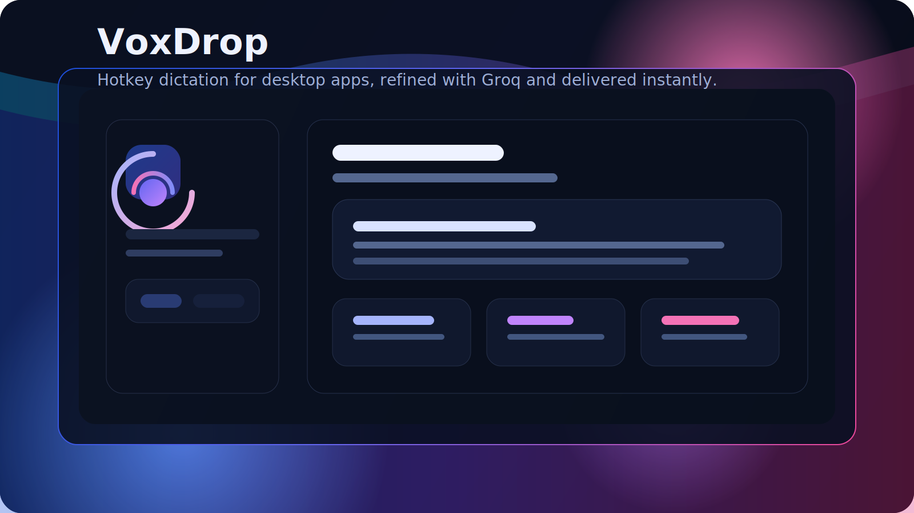

<p align="center">
  
</p>

<h1 align="center">✨ VoxDrop ✨</h1>

<p align="center">
  <em>Speak naturally. Let AI do the typing.</em><br/>
  <strong>Hotkey-powered desktop dictation that captures your voice, cleans it up with Groq AI, expands your shortcuts, and seamlessly pastes polished text into any app you're using.</strong>
</p>

<p align="center">
  <a href="https://github.com/Kutral/VoxDrop/releases">
    
  </a>
  <a href="./LICENSE">
    
  </a>
</p>

---

## ⚡ Why VoxDrop?

We've all been there: your brain is moving a million miles a minute, but your fingers can't keep up. **VoxDrop is built for the moment when typing is slower than thinking.** 

Hold a single global shortcut, speak your mind naturally, and release. VoxDrop works in the background to transcribe, reformat, and instantly paste the perfect text into your active window. Perfect for emails, coding, creative writing, or just saving time!

---

## 🌟 Magic Features

<table>
  <tr>
    <td width="50%">
      <h3>🎙️ Instant Dictation</h3>
      <p>Hold your global shortcut anywhere on your PC. A sleek, unobtrusive "listening pill" pops up. Speak, release, and watch the text appear.</p>
    </td>
    <td width="50%">
      <h3>🧠 AI-Powered Polish</h3>
      <p>Powered by <strong>Groq Whisper</strong> for lightning-fast transcription and <strong>Groq Llama</strong> to clean up "ums," "ahs," and formatting without changing your tone.</p>
    </td>
  </tr>
  <tr>
    <td width="50%">
      <h3>✂️ Smart Snippets</h3>
      <p>Speak a trigger phrase (like "my-email") and VoxDrop automatically expands it into your full email address or canned response before pasting.</p>
    </td>
    <td width="50%">
      <h3>🎯 Native Integration</h3>
      <p>No more copying and pasting from a separate app. VoxDrop injects the final polished text directly into whichever application currently has your focus.</p>
    </td>
  </tr>
</table>

---

## 🚀 Get Started in Seconds

### 🎁 Option 1: Just Give Me The App! (Recommended)
Want to start talking right away?
1. Head over to our **[Releases Page](https://github.com/Kutral/VoxDrop/releases)**.
2. Download the latest `.exe` installer.
3. Run it, log in with your Groq API key, and you are ready to roll!

### 🛠️ Option 2: I Want to Tinker (Developers)
Love looking under the hood? 
```bash
# Clone the magic
git clone https://github.com/Kutral/VoxDrop.git
cd VoxDrop

# Install dependencies
npm install

# Launch in dev mode (Live Reload enabled!)
npm run tauri dev
```

---

## 🎮 How to Use VoxDrop

### The Golden Rule: Hold to Speak
1. **Hold** `Ctrl + Shift + Space` (Default).
2. **Speak** your thoughts.
3. **Release** the keys. *Boom. Text pasted.*

### ⚙️ Make It Yours
Don't like the default hotkey? No problem.
- Open the VoxDrop dashboard.
- Head to **Settings**.
- Click the hotkey input and press your favorite combo (e.g., `Ctrl + Alt + V`). *Note: Requires at least 2 modifier keys to keep your typing safe from accidental triggers!*

### 🪄 Snippets (Your Secret Weapon)
Stop typing the same things over and over.
- Go to the **Snippets** tab.
- Add a **Trigger**: `brb`
- Add an **Expansion**: `I'll be right back, just grabbing a coffee!`
- Next time you dictate "brb", VoxDrop does the heavy lifting.

*(Pro Tip: If your settings ever feel "stuck", just open the app, press `F12` for DevTools, go to Application -> Local Storage, clear it, and restart!)*

---

## 🧩 The Tech Magic Behind the Curtain

Built with speed, aesthetics, and performance in mind:

<p align="center">
  
  
  
  
  
  
  
</p>

---

<p align="center">
  <br/>
  Made with ❤️ by <strong>Kutral Eswar</strong>
  <br/>
  <br/>
  <em>Open source and free forever. Contributions welcome!</em>
</p>
