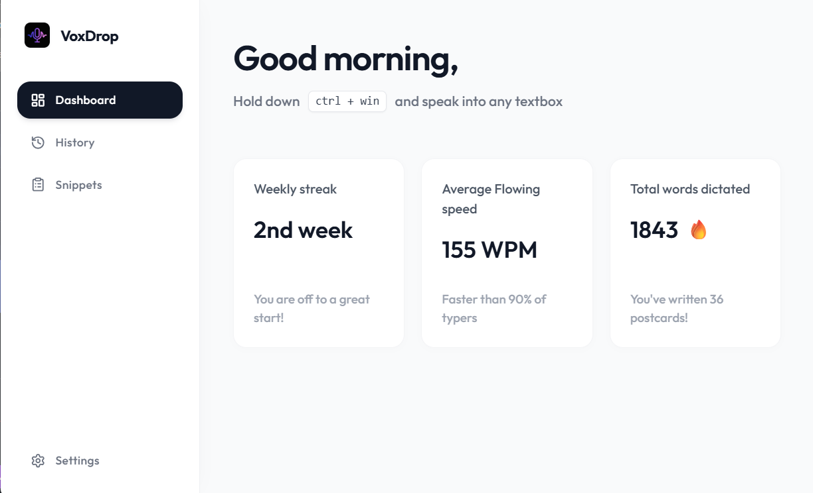
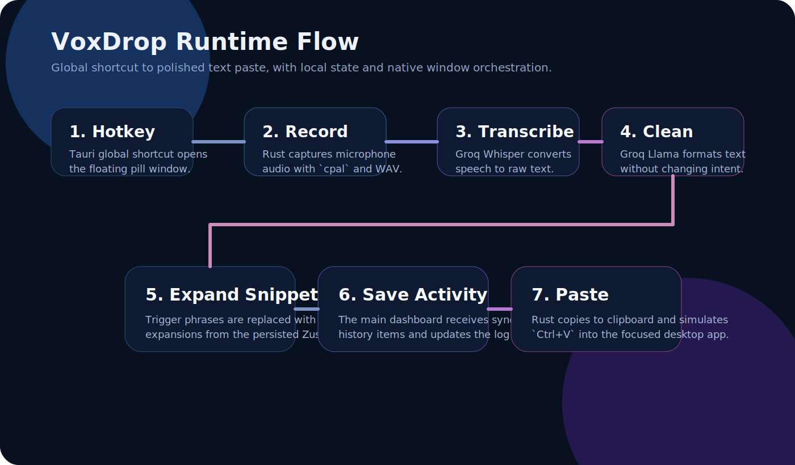

<h1 align="center">🎙️ VoxDrop</h1>

<p align="center">
  <b>The fastest way to get your thoughts onto the screen.</b><br/>
  <i>Desktop dictation for Windows with a global hotkey, a floating listening pill, lightning-fast Groq-powered transcription, smart text cleanup, and instant snippet expansion.</i>
</p>

<p align="center">
  <a href="https://github.com/Kutral/VoxDrop/releases"></a>
  <a href="https://tauri.app/"></a>
  <a href="https://react.dev/"></a>
  <a href="https://rust-lang.org/"></a>
  <a href="./LICENSE"></a>
</p>

<hr/>

<p align="center">
  
</p>

## ✨ Why VoxDrop?

VoxDrop is designed for **fast desktop-first writing, short-form replies, repetitive text entry, and voice-driven workflows.** It bypasses the need for typing out long thoughts, giving you a seamless bridge between your voice and your active application.

Unlike heavy Electron-based alternatives, VoxDrop is built with Rust and Tauri, meaning it is **ultra-lightweight—using only ~3.4 MB of RAM** while idling in your background.

Hold a hotkey, speak your mind, release, and watch as perfectly polished text is magically pasted exactly where your cursor is.

## 🚀 Core Flow

1. **Hold** your custom dictation hotkey (default: `Ctrl + Win`).
2. **Speak** naturally while the unobtrusive floating pill listens.
3. **Release** the keys.
4. **Magic happens:** VoxDrop records the audio, transcribes it instantly with Groq Whisper, polishes it with a Groq Llama model, expands any snippets, and pastes the final text directly into your active window.

## 🌟 Features

- **⚡ Global Hotkey Dictation:** Start dictating from *any* application.
- **🚀 Ultra-Lightweight:** Native Rust core that sips resources, using **only 3.4 MB of RAM**.
- **📊 Personalized Dashboard:** Real-time metrics for your weekly streak, average dictation speed (WPM), and total words dictated.
- **💊 Floating Listening Pill:** A beautiful, non-intrusive UI element that appears above your taskbar only when listening.
- **🎵 Native Media Control:** Automatically pauses background music (Spotify, YouTube, etc.) via Windows kernel APIs while you dictate.
- **🧠 Groq Whisper Transcription:** Industry-leading, ultra-fast speech-to-text.
- **✨ Smart Text Cleanup:** Uses Groq Llama models to fix punctuation, grammar, and formatting automatically.
- **✂️ Snippet Expansion:** Create voice macros! Say a trigger phrase (like `my-link`) and VoxDrop pastes the expansion (`https://github.com/Kutral`).
- **⚙️ Local Settings & History:** Everything is stored locally on your machine for privacy and speed.
- **💻 Desktop Native:** Built with Tauri & Rust for a lightweight footprint and native Windows hooks.

---

## 🛠️ Installation & Usage

### 📥 Option 1: Permanent Installation (Recommended)

1. Head over to the [Releases](https://github.com/Kutral/VoxDrop/releases) page.
2. Download the latest Windows installer (`.msi` or `.exe`).
3. Run the installer and launch VoxDrop from your Start Menu.

### ⌨️ How to Use

1. Ensure VoxDrop is running in the background.
2. Click into any text field in any app (Word, Chrome, Discord, etc.).
3. Hold `Ctrl + Win`.
4. Speak your message.
5. Release the keys. Your text will be instantly pasted!

*You can customize the hotkey at any time in the VoxDrop Settings.*

---

## 🔧 Setup Guide

### 🔑 Connecting to Groq

VoxDrop relies on Groq for its blazing-fast transcription and cleanup models. You'll need an API key to get started.

1. Get your free API key from the [Groq Console](https://console.groq.com/).
2. Open the VoxDrop app window.
3. Navigate to **Settings**.
4. Paste your key into the **Neural API Key** field and click **Authenticate**.

### 📝 Using Snippets

Snippets are powerful voice shortcuts.

1. Open the **Snippets** tab in VoxDrop.
2. Add a **Trigger Phrase** (e.g., `sign-off`).
3. Add an **Expansion** (e.g., `Best regards,\nJohn Doe`).
4. Next time you dictate "sign off", VoxDrop will instantly type out your full signature!

---

## 💻 Local Development

Want to hack on VoxDrop? The stack is **Tauri + Rust + React + TypeScript + Tailwind**.

### Prerequisites
- [Node.js](https://nodejs.org/) & npm
- [Rust stable toolchain](https://rustup.rs/)
- [Tauri Windows prerequisites](https://tauri.app/start/prerequisites/) (C++ Build Tools, WebView2)

### Getting Started

```powershell
# 1. Clone the repository and install dependencies
git clone https://github.com/Kutral/VoxDrop.git
cd VoxDrop
npm install

# 2. Run in development mode (Live Reloading!)
npm run tauri dev
```

### Building for Production

```powershell
# Generate a Windows installer
npm run tauri build
```
*The installer will be generated at `src-tauri\target\release\bundle\msi\`.*

---

## 📐 Architecture

<p align="center">
  
</p>

VoxDrop uses a unique architecture leveraging Rust for low-level OS hooks (global hotkeys, audio capture, clipboard simulation) and React for a beautiful, responsive configuration UI and floating pill interface.

Read the detailed [Project Documentation](./project.md) to learn more about the directory structure and technical decisions.

---

## 📜 License

Project is open-source and available under the [MIT License](./LICENSE).

<p align="center">
  <i>Built with ❤️ for faster workflows.</i>
</p>