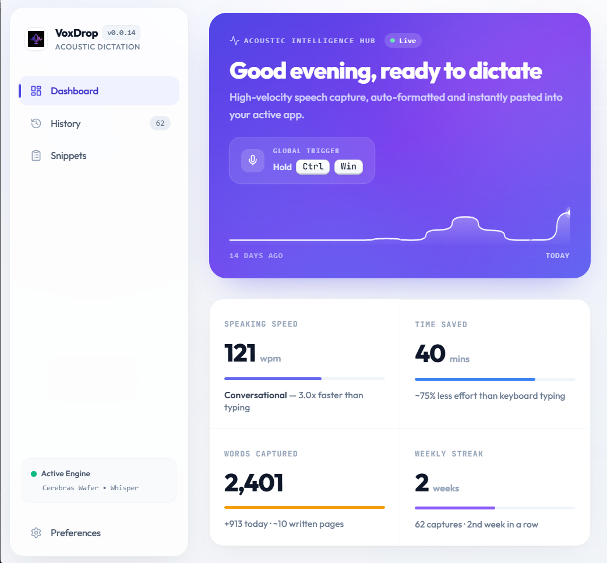
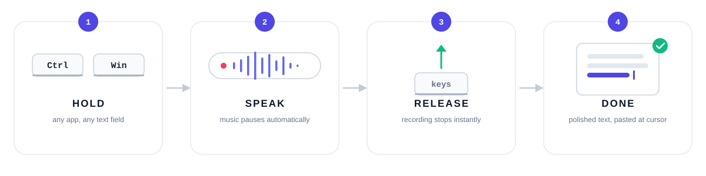
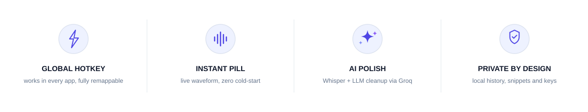
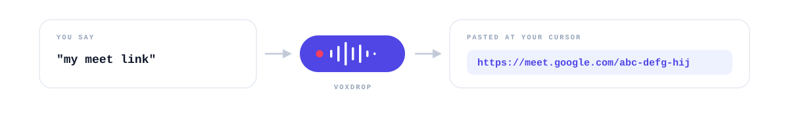
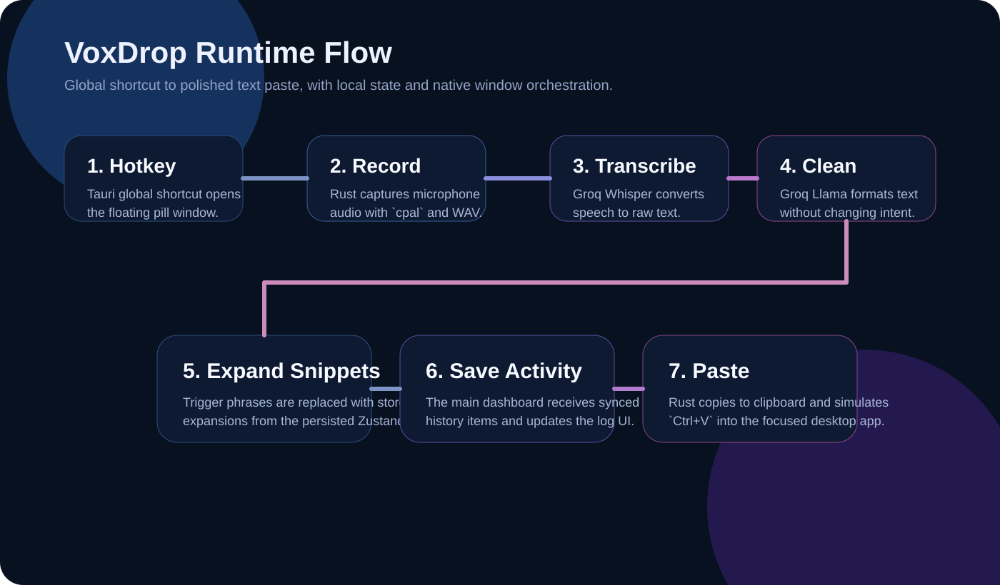

<h1 align="center">
  <br/>
  <strong>VoxDrop</strong>
</h1>

<p align="center">
  <strong>Speak. Release. It's typed.</strong><br/>
  Hold a hotkey anywhere in Windows, say what you mean, and watch polished text<br/>
  land in whatever app you're using.
</p>

<p align="center">
  <a href="https://github.com/Kutral/VoxDrop/releases/latest"></a>
</p>

<p align="center">
  <a href="https://github.com/Kutral/VoxDrop/releases"></a>
  <a href="https://tauri.app/"></a>
  <a href="https://rust-lang.org/"></a>
  <a href="https://react.dev/"></a>
  <a href="./LICENSE"></a>
</p>

<p align="center">
  
</p>

---

<p align="center">
  <strong>&lt; 50 ms hotkey response</strong> &nbsp;·&nbsp; <strong>near-zero idle footprint</strong> &nbsp;·&nbsp; <strong>100% local history</strong>
</p>

<p align="center">
  
</p>

## How it works

<p align="center">
  
</p>

## Why it sticks

<p align="center">
  
</p>

<details>
<summary><strong>Model lineup</strong> — Whisper for ears, an LLM for manners</summary>

| Stage | Options |
|---|---|
| Transcription | Whisper **Turbo** (near-instant) · Whisper **Large V3** (max quality) |
| Text polish — Groq | GPT-OSS 20B · GPT-OSS 120B · Qwen 3.6 27B · ALLaM 2 7B |
| Text polish — Cerebras | Gemma 4 31B · GPT-OSS 120B |

Switch providers and models any time in Preferences. Inline key testing confirms credentials before your first dictation.

</details>

## Voice snippets

<p align="center">
  
</p>

<p align="center">
  Templates, signatures, code blocks — anything you repeat.<br/>
  Create one in the <strong>Snippets</strong> tab: trigger <code>sign-off</code>, expansion <code>Best regards, John</code> — done.
</p>

## Installation

| | |
|---|---|
| **1** | Download [`VoxDrop_x64-setup.exe`](https://github.com/Kutral/VoxDrop/releases/latest) (or the `.msi`) from Releases |
| **2** | Install, launch from the Start Menu |
| **3** | Preferences → paste your free [Groq API key](https://console.groq.com/keys) → **Authenticate** |

> **Requirements:** Windows 10/11 64-bit · WebView2 (auto-installed) · free Groq account
>
> **SmartScreen:** installers aren't code-signed yet — if Windows warns on first run, choose **More info → Run anyway**.

## Under the hood

<p align="center">
  
</p>

Two windows, one Rust core:

- **Main window** — the React dashboard: telemetry, history, snippets, preferences
- **Pill window** — a transparent overlay pre-created at startup and kept render-ready, so the dictation UI appears the instant you release the hotkey

The Rust layer owns everything latency-sensitive: the low-level keyboard hook, audio capture via `cpal`, media control via the `windows` crate, and clipboard pasting via Win32 — keeping hotkey-to-recording under 50 ms.

<details>
<summary><strong>Build from source</strong></summary>

**Prerequisites:** [Node.js](https://nodejs.org/) · [Rust](https://rustup.rs/) · [Tauri's Windows prerequisites](https://tauri.app/start/prerequisites/)

```bash
git clone https://github.com/Kutral/VoxDrop.git
cd VoxDrop
npm install

# development (Vite + hot reload)
npm run tauri dev

# production installer
npm run tauri build
```

</details>

## License

[MIT](./LICENSE) — built for faster workflows.
