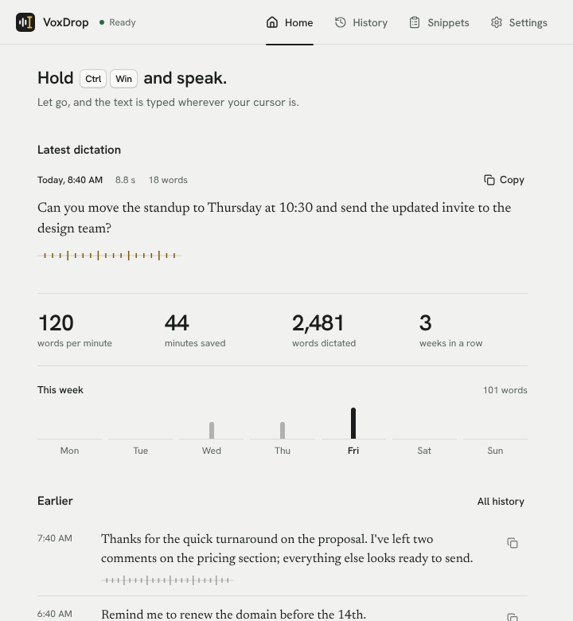
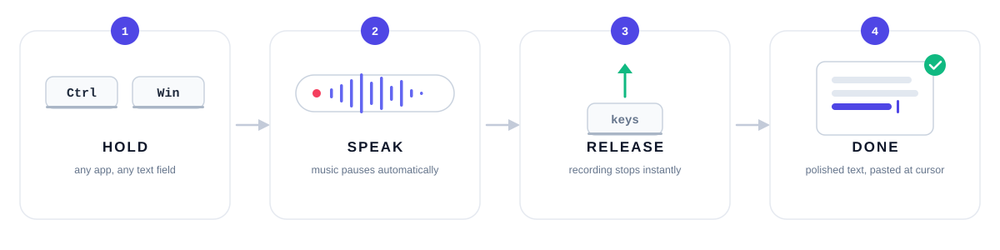
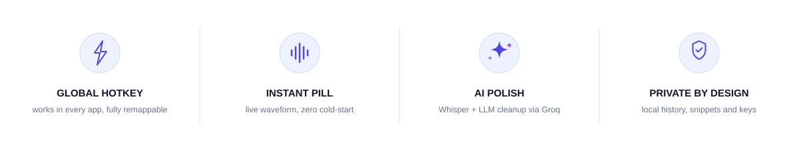
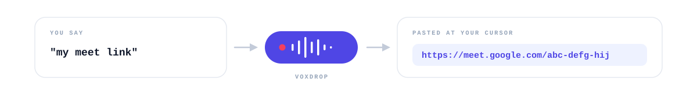
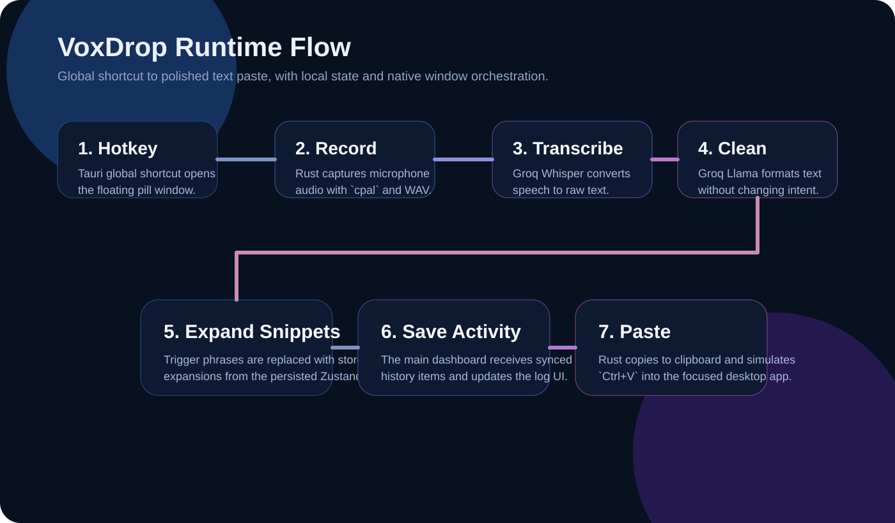

<h1 align="center">
  <br/>
  <strong>VoxDrop</strong>
</h1>

<p align="center">
  <strong>Speak. Release. It's typed.</strong><br/>
  Hold a hotkey anywhere in Windows, say what you mean, and watch polished text<br/>
  land in whatever app you're using.
</p>

<p align="center">
  <a href="https://github.com/Kutral/VoxDrop/releases/latest"></a>
</p>

<p align="center">
  <a href="https://github.com/Kutral/VoxDrop/releases"></a>
  <a href="https://tauri.app/"></a>
  <a href="https://rust-lang.org/"></a>
  <a href="https://react.dev/"></a>
  <a href="./LICENSE"></a>
</p>

<p align="center">
  
</p>

---

<p align="center">
  <strong>&lt; 50 ms hotkey response</strong> &nbsp;·&nbsp; <strong>near-zero idle footprint</strong> &nbsp;·&nbsp; <strong>100% local history</strong>
</p>

<p align="center">
  
</p>

## How it works

<p align="center">
  
</p>

## Why it sticks

<p align="center">
  
</p>

<details>
<summary><strong>Model lineup</strong> — Whisper for ears, an LLM for manners</summary>

| Stage | Model | Speed |
|---|---|---|
| Transcription | Whisper **Turbo** (default) | ~0.6 s for 20 s of audio |
| | Whisper **Large v3**, better with accents and names | ~0.7 s for 20 s of audio |
| Polish, Groq | **Qwen 3.8 27B** (default), best formatting | ~0.2 s |
| | GPT-OSS 20B | ~0.6 s |
| | GPT-OSS 120B | ~0.8 s |
| | ALLaM 2 7B, fastest but keeps fillers (built for Arabic) | ~0.15 s |
| Polish, Cerebras | **GPT-OSS 120B** (default) | ~3000 tok/s (published) |
| | Qwen 3.8 27B | ~1,850 tok/s (published) |

Groq times are measured cleanup round trips on a typical dictation. The model picker shows these speeds, lists any other chat model your key can use, and greys out ones it can't. Switch providers and models any time in Settings, or turn polish off entirely. Pasting a key tests it automatically. If a model is retired, VoxDrop falls back to the default instead of failing.

</details>

## Voice snippets

<p align="center">
  
</p>

<p align="center">
  Templates, signatures, code blocks — anything you repeat.<br/>
  Create one in the <strong>Snippets</strong> tab: phrase <code>sign off</code>, text <code>Best regards, John</code> — done.
</p>

## Installation

| | |
|---|---|
| **1** | Download [`VoxDrop_x64-setup.exe`](https://github.com/Kutral/VoxDrop/releases/latest) (or the `.msi`) from Releases |
| **2** | Install, launch from the Start Menu |
| **3** | VoxDrop opens on Settings: paste your free [Groq API key](https://console.groq.com/keys) and it is tested automatically |

> **Requirements:** Windows 10/11 64-bit · WebView2 (auto-installed) · free Groq account
>
> **SmartScreen:** installers aren't code-signed yet — if Windows warns on first run, choose **More info → Run anyway**.

## Under the hood

<p align="center">
  
</p>

Two windows, one Rust core:

- **Dashboard** (`index.html`): history, snippets and settings. Closing it frees its memory; VoxDrop keeps running in the tray.
- **Pill** (`pill.html`): a tiny separate page in a transparent overlay, pre-created at startup so it appears within milliseconds of the hotkey. It shows a hollow dot while the microphone opens and plays the start tone only once it is live, so no words go into a closed mic. It never loads the dashboard's code.

**Instant start** (Settings → Recording, off by default): opening a Windows microphone stream takes 0.4–1 s on some laptops. With Instant start on, VoxDrop keeps the stream open between dictations so recording begins the moment you press; Windows shows the mic-in-use icon while it is on.

The Rust layer owns the dictation session from press to release: the low-level keyboard hook, audio capture via `cpal` (16 kHz mono, silence trimmed before upload), media pause/resume, and clipboard pasting via Win32, which puts your previous clipboard text back afterwards.

<details>
<summary><strong>Build from source</strong></summary>

**Prerequisites:** [Node.js](https://nodejs.org/) · [Rust](https://rustup.rs/) · [Tauri's Windows prerequisites](https://tauri.app/start/prerequisites/)

```bash
git clone https://github.com/Kutral/VoxDrop.git
cd VoxDrop
npm install

# development (Vite + hot reload)
npm run tauri dev

# production installer
npm run tauri build
```

</details>

## License

[MIT](./LICENSE) — built for faster workflows.
